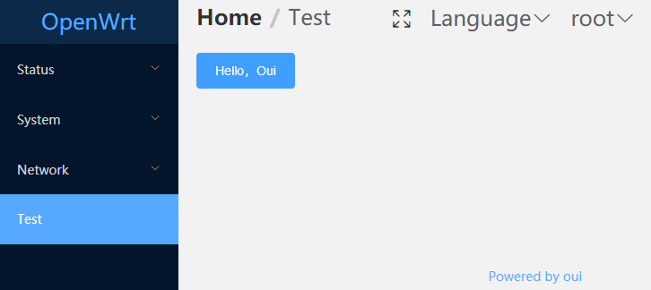
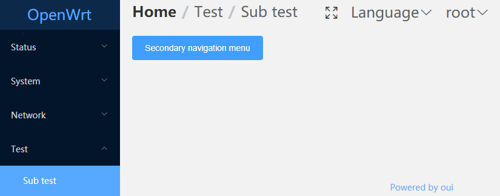

# 快速上手

::: tip
阅读本教程，需要开发者具备[vue](https://cn.vuejs.org/)基础知识
:::

## 添加一个页面

### 首先添加导航菜单

导航菜单配置文件存储路径为：`oui-ui-core/files/usr/share/oui/menu.d`

你可以在已有的菜单配置文件里面添加或者新建一个文件。导航菜单分为一级导航菜单和二级导航菜单。

比如新建一个导航菜单配置文件：`oui-ui-core/files/usr/share/oui/menu.d/test.json`

``` json
{
  "test": {
    "title": "Test",
    "index": 90,
    "view": "test"
  }
}
```

- 这里的第一个`test`表示菜单的导航路径为`/test`
- `title`: 菜单标题
- `index`: 用于菜单排序，越小越靠前
- `view`: 菜单对应的vue组件路径

### 为刚刚添加的导航菜单添加页面

创建一个非常简单的Vue组件: `oui/oui-ui-core/src/src/views/test.vue`

```
<template>
  <el-button type="primary">你好，Oui</el-button>
</template>
```

重新编译oui并更新到设备。效果如下：


### 二级导航菜单

``` json
{
  "test": {
    "title": "Test",
    "index": 90
  },
  "test/sub": {
    "title": "Sub test",
    "index": 1,
    "view": "test/sub"
  }
}
```

将之前添加的test.vue删除，并添加新的vue组件：`oui/oui-ui-core/src/src/views/test/sub.vue`

```
<template>
  <el-button type="primary">二级导航菜单</el-button>
</template>
```
重新编译oui并更新到设备。效果如下：


## 存取数据

oui存取的所有数据均来自于后端提供的`ubus`服务。因此你必须为你的数据提供`ubus`服务。

OpenWrt提供了多种方式，用来注册ubus服务。这里给出了一个计数器的例子。
``` bash
root@OpenWrt:~# ubus -v list counter
'counter' @18abaa64
        "get":{}
        "add":{"value":"Integer"}
root@OpenWrt:~# ubus call counter get
{
        "count": 0
}
root@OpenWrt:~# ubus call counter add '{"value": 10}'
{
        "count": 10
}
root@OpenWrt:~# ubus call counter get
{
        "count": 10
}
```

### 方式1: 调用ubus提供的库，编写独立运行的可执行程序。

C语言版本
``` C
#include <libubox/blobmsg_json.h>
#include <libubus.h>

static int count;

static int counter_get(struct ubus_context *ctx, struct ubus_object *obj,
		      struct ubus_request_data *req, const char *method,
		      struct blob_attr *msg)
{
	struct blob_buf b = {};
	
	blob_buf_init(&b, 0);

	blobmsg_add_u32(&b, "count", count);
	ubus_send_reply(ctx, req, b.head);
	blob_buf_free(&b);

	return 0;
}

enum {
	COUNTER_VALUE,
	__COUNTER_MAX
};

static const struct blobmsg_policy counter_policy[] = {
	[COUNTER_VALUE] = { .name = "value", .type = BLOBMSG_TYPE_INT32 },
};

static int counter_add(struct ubus_context *ctx, struct ubus_object *obj,
		      struct ubus_request_data *req, const char *method,
		      struct blob_attr *msg)
{
	struct blob_attr *tb[__COUNTER_MAX];
	struct blob_buf b = {};
	
	blobmsg_parse(counter_policy, __COUNTER_MAX, tb, blob_data(msg), blob_len(msg));
	
	if (!tb[COUNTER_VALUE])
		return UBUS_STATUS_INVALID_ARGUMENT;	

	count = blobmsg_get_u32(tb[COUNTER_VALUE]);

	blob_buf_init(&b, 0);

	blobmsg_add_u32(&b, "count", count);
	ubus_send_reply(ctx, req, b.head);
	blob_buf_free(&b);

	return 0;
}

static const struct ubus_method counter_methods[] = {
	UBUS_METHOD_NOARG("get", counter_get),
	UBUS_METHOD("add", counter_add, counter_policy)
};

static struct ubus_object_type counter_object_type =
	UBUS_OBJECT_TYPE("counter", counter_methods);

static struct ubus_object counter_object = {
	.name = "counter",
	.type = &counter_object_type,
	.methods = counter_methods,
	.n_methods = ARRAY_SIZE(counter_methods),
};

int main(int argc, char **argv)
{
	struct ubus_context *ctx;

	uloop_init();

	ctx = ubus_connect(NULL);
	if (!ctx) {
		fprintf(stderr, "Failed to connect to ubus\n");
		return -1;
	}

	ubus_add_uloop(ctx);
	ubus_add_object(ctx, &counter_object);
	uloop_run();

	ubus_free(ctx);
	uloop_done();

	return 0;
}
```

Lua版本
``` Lua
#!/usr/bin/lua

local ubus = require "ubus"
local uloop = require "uloop"
local count = 0

uloop.init()

local conn = ubus.connect()
if not conn then
	error("Failed to connect to ubus")
end

local methods = {
	counter = {
		get = {
			function(req, msg)
				conn:reply(req, {count = count})
			end, {}
		},
		add = {
			function(req, msg)
				count = msg.value
				conn:reply(req, {count = count})
			end, {value = ubus.INT32 }
		}
	}
}

conn:add(methods)
uloop.run()
```

方式2: 编写[rpcd](https://openwrt.org/start?id=docs/techref/rpcd)插件

  Shell
``` bash
#!/bin/sh
. /usr/share/libubox/jshn.sh

case "$1" in
	list)
		echo '{"get": { }, "add": {"value": 0}}'
	;;
	call)
		case "$2" in
			get)
				[ -f /tmp/counter ] || echo -n 0 > /tmp/counter
				count=$(cat /tmp/counter)
				echo "{ \"count\": $count }"
			;;
			add)
				read input
				json_load $input
				json_get_var add value
				
				[ -f /tmp/counter ] || echo -n 0 > /tmp/counter
				count=$(cat /tmp/counter)
				
				let count=count+$add
				echo -n $count > /tmp/counter
				
				echo "{ \"count\": $count }"
		esac
	;;
esac
```

Lua
``` Lua
#!/usr/bin/lua

local cjson = require("cjson")

local list = {
	get = {},
	add = {value = 0}
}

local function get_count()
	local count = 0
	local f = io.open("/tmp/counter", "r")
	if f  then
		count = f:read("*a")
		f:close()
	else
		os.execute("echo -n 0 > /tmp/counter")
	end
	return count
end

if arg[1] == "list" then
	print(cjson.encode(list))
elseif arg[1] == "call" then
	if arg[2] == "get" then
		local count = get_count()
		print(cjson.encode({count = count}))
	elseif arg[2] == "add" then
		local args = io.read("*a")
		args = cjson.decode(args)
		local count = get_count() + args.value
		os.execute(string.format("echo -n %d > /tmp/counter", count))
		print(cjson.encode({count = count}))
	end
end
```