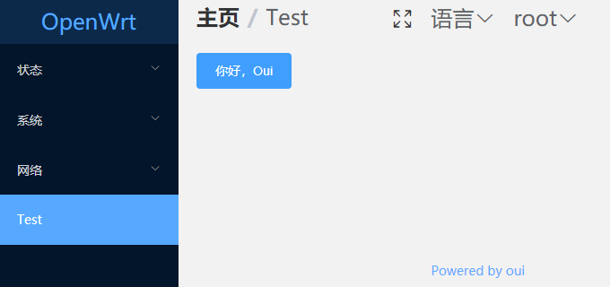
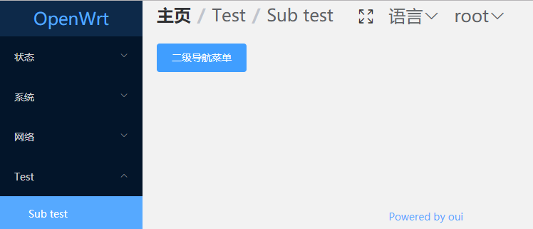

# 快速上手

::: tip
阅读本教程，需要读者具备vue基础知识
:::

## 添加一个页面

### 首先添加导航菜单

导航菜单配置文件存储路径为：`oui-ui-core/files/usr/share/oui/menu.d`

你可以在已有的菜单配置文件里面添加或者新建一个文件。导航菜单分为一级导航菜单和二级导航菜单。

比如新建一个导航菜单配置文件：`oui-ui-core/files/usr/share/oui/menu.d/test.json`

``` json
{
  "test": {
    "title": "Test",
    "index": 90,
    "view": "test"
  }
}
```

- 这里的第一个`test`表示菜单的导航路径为`/test`
- `title`: 菜单标题
- `index`: 用于菜单排序，越小越靠前
- `view`: 菜单对应的vue组件路径

### 为刚刚添加的导航菜单添加页面

创建一个非常简单的Vue组件: `oui/oui-ui-core/src/src/views/test.vue`

```
<template>
  <el-button type="primary">你好，Oui</el-button>
</template>
```

重新编译oui并更新到设备。效果如下：


### 二级导航菜单

``` json
{
  "test": {
    "title": "Test",
    "index": 90
  },
  "test/sub": {
    "title": "Sub test",
    "index": 1,
    "view": "test/sub"
  }
}
```

将之前添加的test.vue删除，并添加新的vue组件：`oui/oui-ui-core/src/src/views/test/sub.vue`

```
<template>
  <el-button type="primary">二级导航菜单</el-button>
</template>
```
重新编译oui并更新到设备。效果如下：


## 存取数据

oui存取的所有数据均来自于后端提供的`ubus`服务。因此你必须为你的数据提供`ubus`服务。